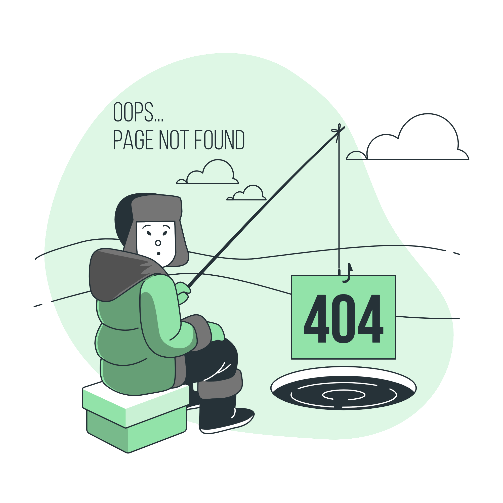

 
        <!-- (The 404 image is at storyset.com) -->
         

             <h1>Oops! Page Not Found <i class = "fas fa-quote-right"></i></h1>
         

       
        
Looks like you are fishing in the wrong hole. Let us head back!

        <a href="#">Back to home</a>

  color: #fff;
    display: flex;
    flex-direction: column;
    justify-content: center;
    align-items: center;
    height: 100vh;
}

img {
    width: 100%;
    max-width: 550px;
    margin-bottom: 1.5rem;
}

.info h1 {
    font-size: 2rem;
    margin-bottom: 1rem;
}

p {
    font-size: 1rem;
    color: #aaa;
    margin-bottom: 2rem;
}

a {
    background-color: #3ecf8e;
    color: #111;
    text-decoration: none;
    padding: 0.75rem 1.5rem;
    border-radius: 8px;
    font-weight: bold;
    transition: background-color 0.3s;
}